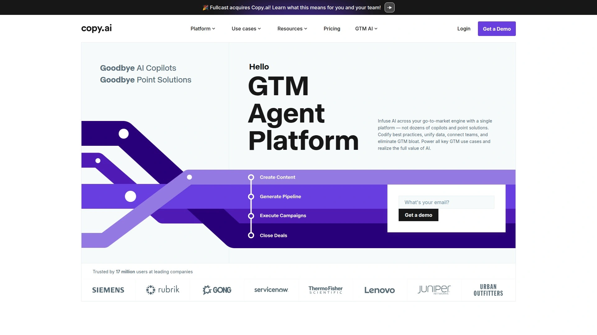
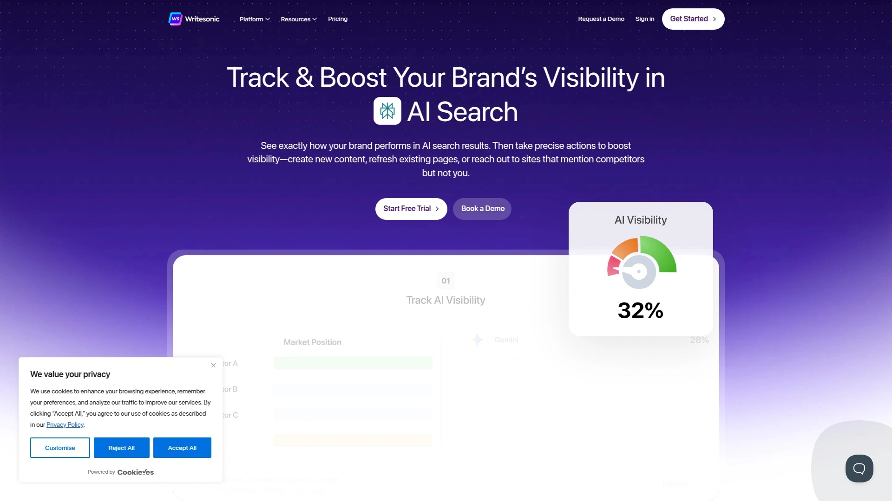
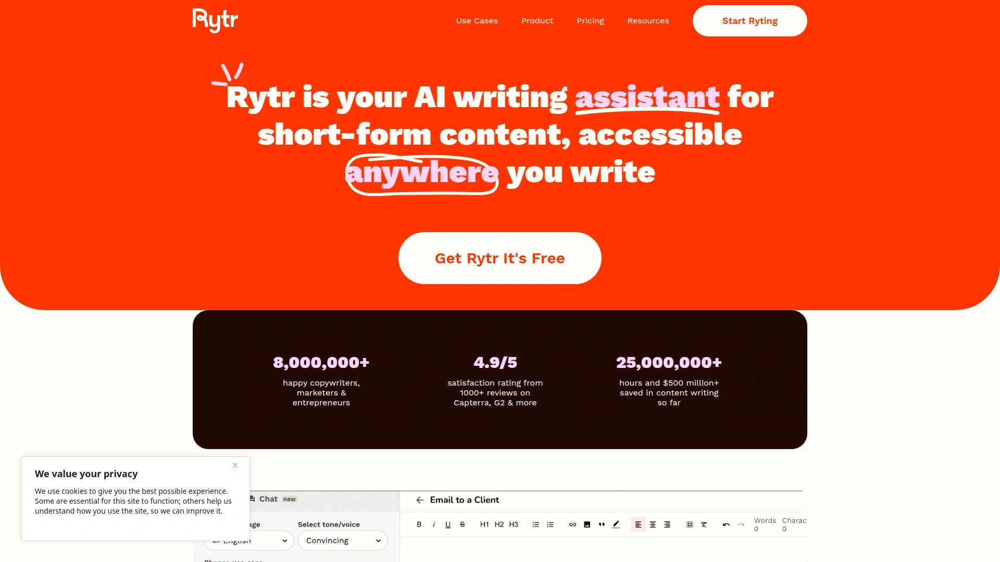
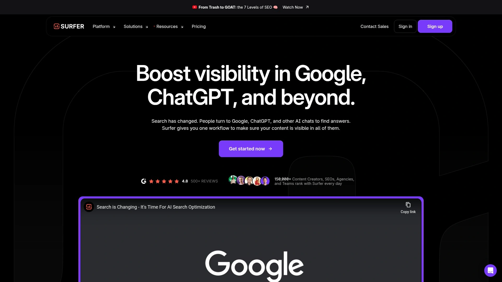
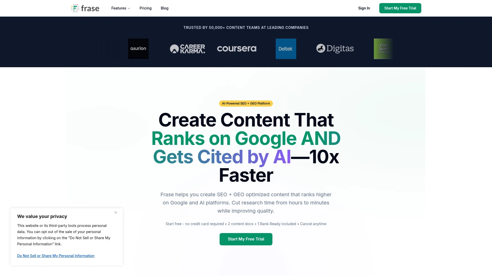
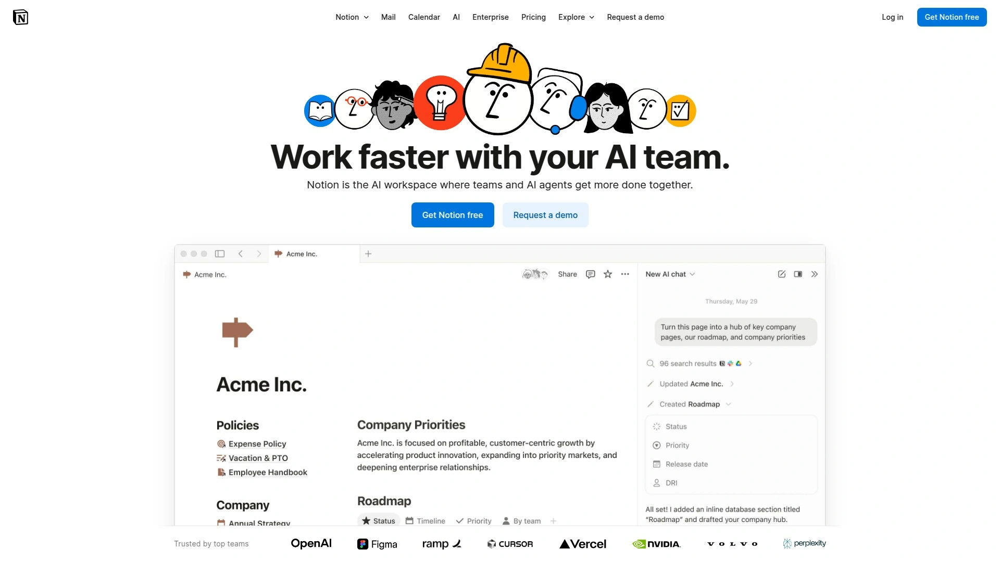
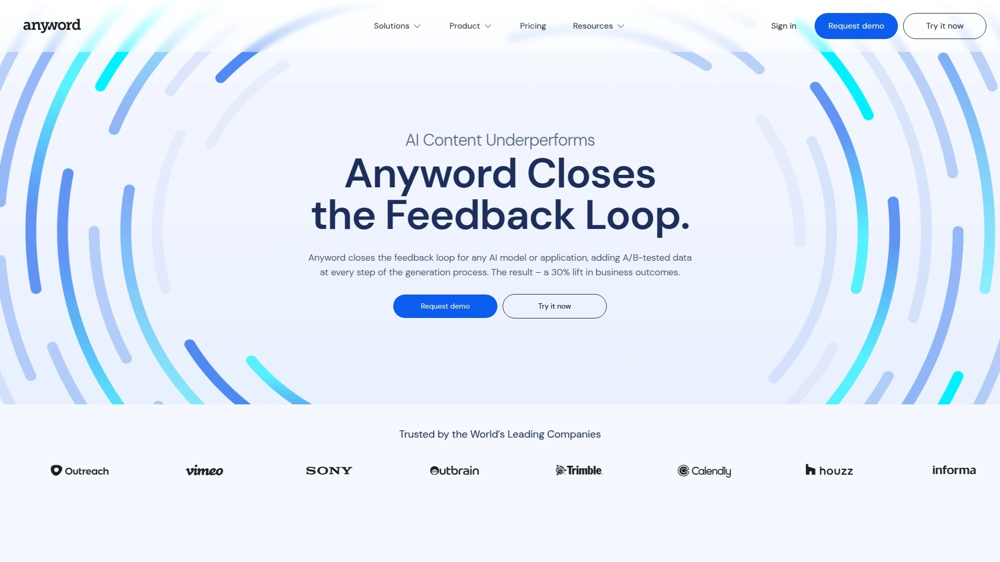
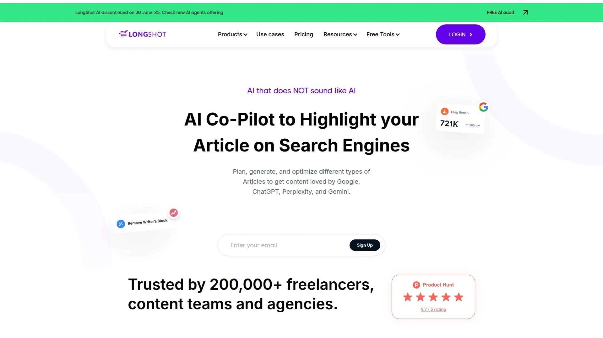

# Top 10 Best AI Content Writing Tools in 2025

Staring at blank pages while deadlines loom crushes productivity, and hiring writers for every blog post or email campaign drains budgets faster than most businesses can sustain. AI content writing tools solve this velocity problem by transforming simple prompts into polished marketing copy, SEO-optimized articles, and on-brand messaging within minutes instead of hours. The challenge is finding platforms that balance generation quality, brand consistency, and pricing flexibility without producing generic content that sounds like every other AI-written piece. These tools handle everything from long-form blog posts to social media captions, turning content bottlenecks into steady workflows that scale with your business.

---

## **[Jasper AI](https://www.jasper.ai)**

Marketing-focused AI platform with Brand IQ learning your voice, 80+ content templates, and autonomous agents optimizing campaigns across channels.

Jasper evolved from writing assistant to complete marketing copilot by embedding company intelligence and end-to-end campaign features directly into workflows. The platform uses advanced language models fine-tuned specifically for marketing use cases, unlike general LLMs producing generic outputs. Brand IQ learns your tone from existing content, uploads company knowledge bases, and enforces style guide rules so AI-generated copy sounds authentically yours.

The app library includes 50+ templates for ad copy, product descriptions, Facebook ads, display ads, and more. Jasper's Optimization Agent autonomously improves headlines and meta descriptions by tapping into SEMrush data. The Personalization Agent turns customer data into tailored content at scale for email and ads. Canvas provides an intuitive workspace where marketing teams collaborate on campaigns. The platform integrates with 1,000+ systems via API and extensions.

Three pricing tiers structure access levels clearly. Creator Plan costs $39 monthly including one brand voice, Jasper Chat, SEO mode, and browser extension. Pro Plan runs $59 monthly adding three brand voices, ten knowledge assets, three instant campaigns, and AI image generation for up to five users. Business Plan offers custom pricing with unlimited feature usage, custom workflows, group collaboration, and enterprise-grade security.

World-class marketing organizations trust Jasper for brand consistency across massive content volumes. The Research Agent turns deep research into on-brand briefs and campaign ideas instantly. Users note the platform integrates beautifully with Surfer SEO for keyword optimization. The seven-day free trial lets teams test all core functions without credit card requirements. Best for content marketing teams prioritizing brand voice consistency and SEO optimization alongside creative generation.

***

## **[Copy.ai](https://www.copy.ai)**

Workflow automation platform building multi-step content processes with sales agents, marketing sequences, and unlimited chat across all major AI models.

Copy.ai focuses beyond individual text generation toward complete workflow automation handling complex multi-step processes. The platform creates ad copy variations, landing page text, email sequences, and social posts through template-driven interface and customizable workflows preserving brand tone. Built-in Brand Voice and Infobase features upload guidelines so AI-generated output aligns with your style automatically.

The Workflow Builder combines triggers, actions, and filters creating sophisticated content automation. Sales workflows handle lead outreach sequences while marketing workflows automate campaign content across channels. Access to all latest LLMs including ChatGPT, Claude, Gemini, and others means you're not locked into one model's strengths and weaknesses. Multilingual support spans 95+ languages for global reach.

Pricing scales from free to enterprise levels. Free Plan provides 2,000 words monthly with one seat and basic Brand Voice access. Chat Plan costs $29 monthly including five seats and unlimited chat words across all models. Agents Plan runs $249 monthly with ten seats, 10,000 workflow credits, and content agents for teams scaling production. Enterprise Plan offers custom pricing with unlimited everything, guided onboarding, and API access.

The platform excels at brainstorming fresh ideas, headlines, and creative angles overcoming writer's block. Tone and style customization adjusts output from casual to professional matching brand personality effortlessly. Users mention limited long-form generation quality requiring frequent manual editing. Teams appreciate transparent pricing structure with flexible plans suited for small to mid-sized operations. Strongest for mid-market marketing teams needing fast flexible AI writing support across campaign channels without overcomplicating processes.

***

## **[Writesonic](https://writesonic.com)**

AI search visibility platform combining GPT-4 content generation with Surfer SEO integration for optimized articles created in 20 minutes.

Writesonic employs cutting-edge AI technology producing quality content handling blog posts, ad copy, and social media with simple templates and prompts. The platform crafts content aiding users in creating top-notch material at breakneck pace, particularly advantageous for content creators, marketers, and businesses producing content regularly. Support spans content generation in 25 languages making it versatile for users worldwide.

Tone control lets users set content mood ranging from excited and professional to funny and dramatic. Writesonic mixes different content creation types within single documents enabling highly tailored pieces. Integration with Surfer SEO brings vital SERP and keyword data into the writing process. Surfer SEO analyzes content in the document editor against top-ranking articles ensuring you hit search intent, NLP semantic coverage, and essential topics visitors expect.

The Chatsonic Chrome extension provides ChatGPT-like capabilities with superpowers directly in your browser. Features include instant answers with current information, voice commands, personality modes, and digital art generation. The platform handles article rewrites, content expansion, and paragraph condensation making it invaluable for enhancing and refining existing material.

Users appreciate the comprehensive feature set combining writing, SEO analysis, and optimization in one interface. Some note occasional quality variations requiring human review before publication. The platform works exceptionally well for SEO-focused content creation where ranking matters as much as readability. Best for bloggers and content marketers prioritizing search visibility alongside content generation speed.

***

## **[Rytr](https://rytr.me)**

Free AI writing assistant with rich text editor, 40+ use cases, and tone customization generating content 10x faster at fraction of traditional costs.

Rytr is a cloud-based writing platform using artificial intelligence to assist content creation built on powerful AI models including OpenAI's GPT-3. The platform proves user-friendly offering features helping users craft compelling well-structured content quickly and efficiently. Rytr excels at generating wide variety of content types with numerous templates spanning blog posts, articles, social media updates, emails, and product descriptions.

The Rich Text Editor elevates capabilities beyond standard text editors with AI-powered enhancements. Users highlight sections and Rytr offers innovative options augmenting content using AI including automatic paragraph generation, content expansion with "Continue Ryting," and contextual improvements. The editor includes formatting options, keyword highlighting, and seamless AI integration within familiar interface.

Rytr provides 40+ use cases and templates covering diverse content needs from blog ideas and outlines to video descriptions and interview questions. Built-in plagiarism checker ensures originality while tone control offers 20+ options matching desired voice. The Chrome extension brings AI writing assistance directly into browser workflow.

Pricing starts with generous free tier making it accessible for testing and light usage. Premium plans unlock additional features, higher word counts, and priority support at competitive rates. Users note outputs serve as valuable starting points though may contain occasional grammatical errors or repetition requiring human review. The platform saves significant time and effort compared to writing everything from scratch. Best for solopreneurs and small businesses wanting capable AI writing assistance without premium pricing commitments.

***

## **[Surfer SEO](https://surferseo.com)**

Content optimization platform analyzing 500+ ranking factors providing real-time scoring as you write with Surfy AI assistant refining copy instantly.

Surfer SEO is a content optimization and analysis tool examining top-performing pages for any keyword providing data-driven recommendations helping you improve content. The system analyzes content against 500+ on-page signals reverse engineering SEO ranking factors found on pages currently ranking for target keywords. Machine learning determines which keywords and formatting prove important to include in posts.

The Content Editor provides real-time data and recommendations as you write. Content Score is a responsive metric showing if you're on track for optimization analyzing keyword usage, entity extraction, link equity, content relevance, topic coverage, and topical authority. Powerful integrations work where you work including Google Docs, ChatGPT, WordPress, and Contentful reducing friction.

Outline Builder structures content into detailed outlines complete with unique potential headings and questions in seconds. Write and optimize simultaneously with real-time metrics for structure, word count, NLP-ready keywords, and images ranking high anywhere in the world regardless of niche or industry. Surfy AI assistant helps edit, rephrase, and refine articles in real-time with Custom Voice writing in unique tone while keeping content SEO-friendly.

Topics feature boosts content depth mapping most relevant ideas and gaps straight from top competitors so content stands out as go-to authority. Users praise the tool as incredibly powerful taking content from good to great. Some find research and planning tools weaker compared to alternatives like Frase or Clearscope. The platform integrates with Jasper AI and other writing tools for seamless workflow. Best for SEO professionals and content teams prioritizing search rankings with data-driven optimization guidance.

***

## **[Frase](https://frase.io)**

SEO and GEO optimization platform tracking dual scores for Google rankings and AI platform citations with competitor analysis and question discovery.

Frase helps create SEO and GEO optimized content ranking higher on Google and AI platforms cutting research time from hours to minutes while improving quality. The platform optimizes content with real-time SEO and GEO recommendations creating citeable rankable content. Frase tracks content performance showing how well material ranks on traditional search engines AND performs on AI platforms like ChatGPT, Perplexity, Claude, and Gemini.

The workflow guides through research, writing, and optimization in five steps. Enter target keywords and Frase searches Google analyzing top 20 results understanding what's ranking. SERP research identifies topics, questions, and content patterns from competitors showing exactly what to cover. Question extraction finds queries users ask about topics boosting chances of getting cited by AI platforms.

AI-generated outlines include headings, subheadings, and suggested content structure optimized for both traditional search and generative AI platforms. Dual scoring system provides separate SEO scores for Google and GEO scores for AI platforms updating in real-time as you write. Optimization suggestions include topic coverage, readability improvements, structure recommendations, and AI-friendly formatting.

The content editor writes and edits with competitor insights and AI search optimization guidance so content always builds to perform. Users regard Frase as best tool for amending existing content, creating new material, and providing specific SEO support. The platform proves cutting-edge helping content creators, marketers, and SEO professionals produce high-quality search-optimized work efficiently. Best for content teams targeting both traditional search visibility and emerging AI platform citations simultaneously.

***

## **[Notion AI](https://www.notion.com)**

Workspace-integrated AI assistant generating content, summarizing documents, and answering questions using your organization's knowledge base contextually.

Notion AI functions as all-in-one tool handling search, generation, analysis, and chat directly inside Notion workspace. The AI assistant extends impact by helping create high-quality content, research topics, and summarize information without leaving familiar environment. Writing assistant generates content from scratch with intelligent prompts including blog post outlines, email drafts, and project descriptions matching workspace tone and style.

Text generation and rewriting transform existing content for clarity, tone, or length making material more professional, casual, concise, or detailed based on specific needs. Translation converts content between languages while maintaining context and meaning especially useful for international teams working in multilingual environments. Document summarization distills complex information converting lengthy meeting transcripts into actionable summaries with key decisions, action items, and next steps highlighted.

The Q&A feature chats and provides instant answers to questions using workspace-specific information. This goes beyond traditional chatbots offering accurate relevant answers preventing hallucination seen in standard LLM models. AI assistant helps quickly find and locate anything within Notion Workspace acting as personal search companion. Built-in spell check and grammar correction fix typos and punctuation errors automatically.

Notion AI seamlessly blends into existing workflows where teams already collaborate and manage projects. The tool proves particularly valuable for product teams boosting productivity and sparking new ideas with brainstorming assistance. Users can highlight text and select "Ask AI" or type "/AI" to get suggestions instantly. Best for teams already using Notion wanting integrated AI capabilities without switching between multiple platforms for content generation and productivity tasks.

***

## **[Anyword](https://www.anyword.com)**

Performance prediction platform using A/B-tested data achieving 82% accuracy determining which content variations convert better before publication.

Anyword closes the feedback loop for any AI model adding A/B-tested data at every generation step resulting in 30% lift in business outcomes. The platform's AI delivers industry-leading performance prediction accurately determining which of two content variations performs better based on audience, business goal, and channel with 82% accuracy compared to generic models achieving only 52%. Marketing teams implementing Anyword report impressive 30% increase in sales and conversion rates compared to baseline AI models.

Content Intelligence System analyzes existing published content comparing it against Anyword's extensive industry-specific A/B test datasets. This reveals immediate opportunities to enhance current content performance while simultaneously improving future AI-generated assets. The system learns from successful content patterns within your industry making increasingly accurate recommendations tailored to specific audiences and goals.

Data-Driven Editor analyzes content in real-time predicting performance metrics before publication. Writers generate multiple variations of headlines, product descriptions, or call-to-action phrases then select highest-performing option based on predictive scores. This eliminates guesswork traditionally associated with content creation reducing need for extensive post-publication testing. Brand Voice Management centralizes messaging frameworks, tone guidelines, audience personas, and communication standards ensuring consistent brand identity.

The Chrome extension enables performance predictions and brand voice application across virtually any web-based writing environment. API access allows developers incorporating performance prediction engine directly into custom applications. Enterprise-grade security includes SSO, multi-factor authentication, SOC 2, ISO 27001, GDPR, and HIPAA compliance. Best for data-driven marketing teams prioritizing conversion performance and businesses wanting predictive analytics guiding content decisions before launch.

***

## **[Longshot AI](https://www.longshot.ai)**

SEO-compliant writing assistant with fact-checking, AI interlinking, and 27 workflow templates starting at competitive pricing for blog-focused creators.

Longshot AI specializes in helping content creators research, generate, and optimize blog content appealing to both human readers and search engine algorithms. The comprehensive approach guides users through entire content creation process from initial research and ideation to final optimization and publication. Workflow-based system makes content creation accessible even to those with limited writing experience.

The process works in four straightforward steps: select workflow from 27 different content templates, generate headlines by inputting topic data, create comprehensive outline based on selected headline, and build first draft transforming outline into complete article ready for review. This approach balances automation and customization where AI handles heavy lifting of research and structure while users maintain creative control.

Built-in fact-checking provides verification unlike most competitors lacking this capability. AI Interlinking automates internal linking not found in competing platforms. Customization allows uploading unlimited assets and defining brand voice ensuring consistent on-brand content. Model diversity uses multiple AI engines including OpenAI GPT-4 and GPT-4o, Anthropic Claude, Cohere, Mistral, and Llama 3.

Integration capabilities span Semrush, Google Search Console, WordPress, Webflow, HubSpot, Google Docs, and Copyscape for plagiarism checking. These connections enable smoother workflows and direct publishing from Longshot AI platform to preferred content management systems. Starting at just $6 monthly the pricing proves significantly lower than competitors like Jasper AI at $39 monthly or Copy AI at $36 monthly. Best for bloggers and content marketers wanting comprehensive SEO-focused writing assistance at budget-friendly pricing with built-in fact verification.

***

## **[ContentBot](https://contentbot.ai)**

Content automation platform with drag-and-drop flow builder creating workflows that generate blog posts, ads, and marketing copy automatically in background.

ContentBot is AI-powered content toolkit letting you automate content creation, build workflows, and import files in just a few clicks. The platform automates content creation process with triggers, actions, and filters linking together to create any content type. Users create daily or weekly automated blog posts without any manual planning or drafting. Simplify content workflow letting AI complete marketing tasks in background automatically.

The drag-and-drop flow builder uses AI to automatically create content via visual interface making automation accessible without coding knowledge. ContentBot makes use of GPT-3 technology ensuring 95% of content proves unique. The import feature transforms existing files into content in just a few clicks. Upload large amounts of data and run prompts in bulk speeding up content creation process.

Outputs arrive as CSV files, documents, or emails sent straight to inbox so nothing slips through cracks. ContentBot interprets or summarizes data from large PDF files saving tons of time. Features include product descriptions, InstructBot ChatGPT equivalent, blog topic ideas, intros, outlines, sentence rewriting, tone changing, listicles, ad copy for platforms, video ideas, landing page content, and copywriting formulas like AIDA, PBS, and PAS.

The WordPress plugin connects to web app allowing import of documents directly into WordPress sites. ContentBot launched as first AI Writer offering WordPress plugin with 11 years specialized WordPress development experience. Plagiarism checker ensures generated content remains original and unique. Content creation spans over 110 languages making it suitable for global audiences. Best for businesses wanting hands-off content automation running in background and WordPress users needing seamless integration with existing publishing workflows.

***

## How do these tools compare for brand voice consistency?

Brand voice features vary significantly impacting output authenticity. Jasper's Brand IQ learns from existing content and enforces style guide rules automatically ensuring consistency across massive volumes. Anyword's Brand Voice Management centralizes messaging frameworks, tone guidelines, and audience personas for unified identity. Copy.ai provides Brand Voice and Infobase features where you upload guidelines aligning AI output with your style. Tools lacking dedicated brand voice training like basic Rytr require manual tone selection for each piece making consistency harder at scale. For organizations prioritizing brand consistency across teams prioritize platforms with trainable brand voice systems that learn your specific style.

## Which platforms work best for SEO-focused content?

SEO optimization capabilities differ dramatically between tools. Surfer SEO analyzes 500+ ranking factors providing real-time scoring as you write with competitor analysis and keyword recommendations. Frase offers dual scoring for both Google SEO and AI platform GEO showing performance across traditional and generative search. Writesonic integrates with Surfer SEO combining content generation with optimization analysis in one workflow. Longshot AI includes built-in fact-checking and AI interlinking specifically for blog SEO. General writing tools like Rytr or Notion AI lack dedicated SEO features requiring separate optimization tools. Content teams prioritizing search rankings should choose platforms with integrated SEO analysis rather than generation-only tools.

## Can these tools handle enterprise-level content volume?

Enterprise scalability depends on pricing structure and collaboration features. Jasper Business Plan offers custom pricing with unlimited usage, custom workflows, and enterprise-grade security suitable for large organizations. Anyword provides 99.9% uptime, global availability, and robust failover systems built for scale with SOC 2, ISO 27001, GDPR, and HIPAA compliance. Copy.ai Enterprise Plan includes guided implementation, API access, and 20+ tech integrations for high-volume operations. ContentBot's automation workflows handle bulk content generation running in background without manual intervention. Smaller tools like Rytr or Longshot AI target individual creators and small teams rather than enterprise scale. Organizations producing hundreds of content pieces monthly should evaluate collaboration features, API access, and custom pricing options.

***

## Write Faster, Rank Higher, Convert Better

AI content writing tools have matured from experimental novelty into production-grade platforms powering blogs, campaigns, and customer communications across industries. Whether you're scaling blog output from weekly to daily, maintaining brand consistency across distributed teams, or optimizing every headline for conversion performance, these tools compress traditional content workflows from days into hours. **[Jasper AI](https://www.jasper.ai)** stands out for marketing teams wanting comprehensive brand voice training with autonomous optimization agents—perfect when you need enterprise-scale content production maintaining authentic brand identity across every channel without endless manual review cycles. The competitive advantage isn't just speed; it's sustaining quality and consistency at volumes that would overwhelm traditional writing teams.
